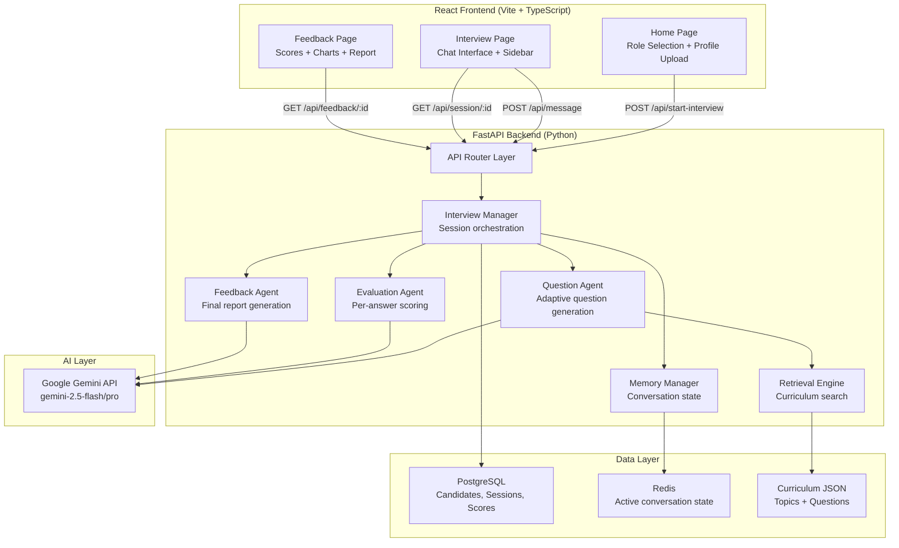
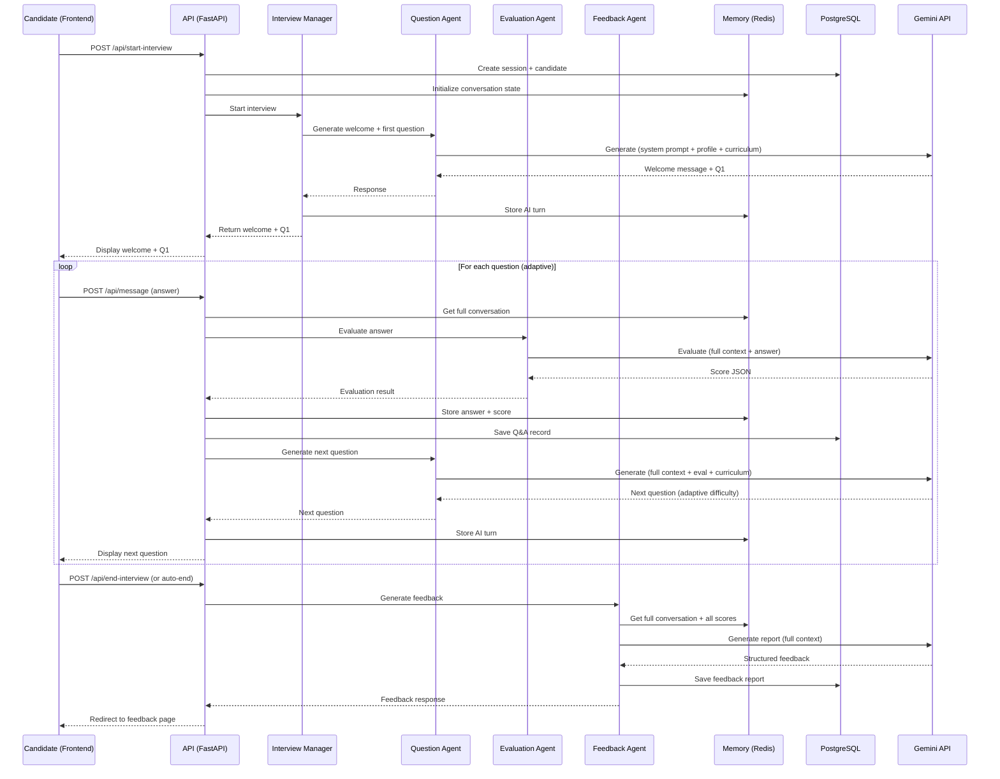

# InterviewAI — Intelligent Technical Interview Platform

Build an AI interviewer that reads candidate profiles and curriculum, conducts adaptive interviews with full conversation memory, dynamically adjusts questions based on answers, scores candidates, and generates recruiter-ready feedback — all exposed via clean REST APIs.

## Tech Stack Summary

| Layer | Technology | Rationale |
|-------|-----------|-----------|
| **Frontend** | React 18 + TypeScript + Vite | Fast dev, modern DX |
| **Styling** | Tailwind CSS + shadcn/ui | Premium components, rapid UI |
| **Animations** | Motion (formerly Framer Motion) | Smooth chat UX, spring physics |
| **Charts** | Recharts | Radar/bar charts for scoring |
| **Backend** | FastAPI (Python 3.12+) | Async, auto-docs, AI ecosystem |
| **AI Model** | Google Gemini (`google-genai` SDK) | User's choice, latest SDK |
| **Database** | PostgreSQL + SQLAlchemy 2.0 async | Full persistence |
| **Session/Cache** | Redis (`redis.asyncio`) | Conversation state, fast access |
| **Migrations** | Alembic | Schema versioning |

---

## User Review Required

> [!IMPORTANT]
> **Gemini API Key**: You'll need to provide your `GOOGLE_API_KEY` in a `.env` file. We'll use the `google-genai` SDK with `gemini-2.5-flash` model (or `gemini-2.5-pro` if you prefer higher reasoning quality — let me know).

> [!IMPORTANT]
> **PostgreSQL & Redis**: You'll need Docker installed to run PostgreSQL and Redis locally via `docker-compose`. If Docker isn't available, I can fall back to SQLite + in-memory session storage.

> [!WARNING]
> **Tailwind CSS**: Per your request, we'll use Tailwind CSS with shadcn/ui. This overrides the default "Vanilla CSS" preference.

---

## Open Questions

> [!IMPORTANT]
> 1. **Which Gemini model?** `gemini-2.5-flash` (faster, cheaper) or `gemini-2.5-pro` (better reasoning)? We can also make this configurable.
> 2. **Do you have Docker installed** for PostgreSQL + Redis? Or should I provide a SQLite fallback?
> 3. **Curriculum format**: Should we pre-create sample curriculum JSONs for roles like "AI Engineer", "Full Stack Developer", "Data Scientist"? Or just one sample?

---

## Architecture Overview



---

## Proposed Changes

### 1. Project Root Setup

#### [NEW] [docker-compose.yml](file:///c:/project%20hackathon/docker-compose.yml)
- PostgreSQL 16 container (port 5432)
- Redis 7 container (port 6379)
- Volume mounts for persistence

#### [NEW] [.env.example](file:///c:/project%20hackathon/.env.example)
- `GOOGLE_API_KEY`, `DATABASE_URL`, `REDIS_URL`, `GEMINI_MODEL`

#### [NEW] [README.md](file:///c:/project%20hackathon/README.md)
- Project overview, setup instructions, API docs, demo script

---

### 2. Backend — FastAPI Application

#### [NEW] [backend/requirements.txt](file:///c:/project%20hackathon/backend/requirements.txt)
Key dependencies:
- `fastapi[all]`, `uvicorn`, `google-genai`
- `sqlalchemy[asyncio]`, `asyncpg`, `alembic`
- `redis`, `python-dotenv`, `pydantic-settings`

#### [NEW] [backend/main.py](file:///c:/project%20hackathon/backend/main.py)
- FastAPI app with lifespan (Redis pool init/teardown)
- CORS middleware for frontend
- Router registration
- Swagger/ReDoc auto-docs at `/docs`

#### [NEW] [backend/config.py](file:///c:/project%20hackathon/backend/config.py)
- `pydantic-settings` based configuration
- Environment variable loading
- Gemini model selection

---

#### API Layer

#### [NEW] [backend/api/routes.py](file:///c:/project%20hackathon/backend/api/routes.py)
Five core endpoints:

| Method | Path | Purpose |
|--------|------|---------|
| `POST` | `/api/start-interview` | Start session: accepts role, candidate profile, curriculum |
| `POST` | `/api/message` | Send candidate answer, receive AI follow-up question |
| `GET` | `/api/session/{id}` | Get session state (progress, question count, timer) |
| `POST` | `/api/end-interview` | End session early, trigger evaluation |
| `GET` | `/api/feedback/{id}` | Get final structured feedback report |

#### [NEW] [backend/api/schemas.py](file:///c:/project%20hackathon/backend/api/schemas.py)
Pydantic models for all request/response DTOs:
- `StartInterviewRequest` (role, candidate_name, resume_text, curriculum_id)
- `MessageRequest` (session_id, answer)
- `MessageResponse` (question, question_number, total_questions, topic, difficulty)
- `SessionResponse` (status, progress, elapsed_time)
- `FeedbackResponse` (overall_score, category_scores, strengths, weaknesses, recommendation, learning_roadmap)

---

#### Agent Layer (the core intelligence)

#### [NEW] [backend/agents/interview_manager.py](file:///c:/project%20hackathon/backend/agents/interview_manager.py)
**The orchestrator.** Responsibilities:
- Initialize interview session with candidate profile + curriculum
- Track interview state (current question number, topics covered, difficulty level)
- Route to Question Agent or Evaluation Agent based on state
- Detect interview completion (all topics covered or max questions reached)
- Trigger Feedback Agent at the end

#### [NEW] [backend/agents/question_agent.py](file:///c:/project%20hackathon/backend/agents/question_agent.py)
**Adaptive question generation.** Key behaviors:
- Receives: curriculum topics, previous conversation, candidate's last answer, evaluated score
- Generates contextual follow-up questions (not random!)
- **Adaptive difficulty**: If candidate scores >8/10 → increase difficulty. If <5/10 → simplify.
- **Topic progression**: Moves through curriculum topics, drilling deeper on strong areas
- **Follow-up logic**: If answer is incomplete → asks clarifying question on same topic
- Prompt engineering with structured output (JSON mode)

#### [NEW] [backend/agents/evaluation_agent.py](file:///c:/project%20hackathon/backend/agents/evaluation_agent.py)
**Per-answer scoring.** After each candidate response:
- Evaluates against: accuracy, completeness, depth, communication clarity
- Returns structured JSON:
  ```json
  {
    "score": 8,
    "accuracy": 9,
    "completeness": 7,
    "depth": 8,
    "communication": 9,
    "reasoning": "Candidate demonstrated strong understanding of CNNs but didn't mention pooling layers...",
    "confidence_indicators": ["used specific examples", "mentioned real projects"],
    "hesitation_indicators": []
  }
  ```
- Detects confidence/hesitation from text analysis

#### [NEW] [backend/agents/feedback_agent.py](file:///c:/project%20hackathon/backend/agents/feedback_agent.py)
**Final report generation.** After interview ends:
- Aggregates all per-answer evaluations
- Generates comprehensive report with:
  - Overall score (0-100)
  - Category scores (technical, communication, problem-solving, confidence)
  - Top 3 strengths with evidence from conversation
  - Top 3 weaknesses with evidence
  - Hiring recommendation (Strong Hire / Hire / Maybe / No Hire)
  - Personalized learning roadmap
  - Key quotes from the interview

---

#### Prompts Layer

#### [NEW] [backend/prompts/system_prompts.py](file:///c:/project%20hackathon/backend/prompts/system_prompts.py)
Carefully engineered prompts for each agent:
- **Interviewer persona**: Professional, encouraging, human-like
- **Question generation**: Context-aware, curriculum-aligned
- **Evaluation criteria**: Rubric-based, consistent scoring
- **Feedback template**: Recruiter-ready format

Each prompt includes:
- System instructions
- Candidate profile context
- Curriculum context
- Full conversation history
- Current answer (for evaluation)

---

#### Memory Manager

#### [NEW] [backend/memory/conversation_memory.py](file:///c:/project%20hackathon/backend/memory/conversation_memory.py)
- Stores full conversation in Redis as JSON (keyed by session_id)
- Appends each turn (AI question + candidate answer + evaluation)
- Retrieves full conversation for each LLM call (no context loss!)
- TTL-based expiry (2 hours for hackathon)

#### [NEW] [backend/memory/session_store.py](file:///c:/project%20hackathon/backend/memory/session_store.py)
- Session metadata in Redis: current question, topic index, difficulty, scores array
- Fast read/write for real-time state

---

#### Retrieval Engine

#### [NEW] [backend/retrieval/curriculum_engine.py](file:///c:/project%20hackathon/backend/retrieval/curriculum_engine.py)
- Loads curriculum JSON files
- Topic-based retrieval: given current progress, returns next relevant topic
- Difficulty mapping: each topic has easy/medium/hard question templates
- Keyword matching against candidate answers to find related follow-up topics

---

#### Database Layer

#### [NEW] [backend/database/connection.py](file:///c:/project%20hackathon/backend/database/connection.py)
- Async SQLAlchemy engine + session factory
- `postgresql+asyncpg` driver
- Connection pooling (pool_size=20, max_overflow=10)

#### [NEW] [backend/database/models.py](file:///c:/project%20hackathon/backend/database/models.py)
SQLAlchemy ORM models:

```python
class Candidate:
    id, name, email, resume_text, created_at

class InterviewSession:
    id, candidate_id, role, curriculum_id, status,
    start_time, end_time, overall_score, recommendation

class QuestionAnswer:
    id, session_id, question_number, topic, difficulty,
    question_text, answer_text, score, evaluation_json

class FeedbackReport:
    id, session_id, overall_score, category_scores_json,
    strengths_json, weaknesses_json, recommendation,
    learning_roadmap_json, created_at
```

#### [NEW] [backend/database/crud.py](file:///c:/project%20hackathon/backend/database/crud.py)
- Async CRUD operations for all models
- Session creation, update, completion
- Score aggregation queries

---

#### Services Layer

#### [NEW] [backend/services/gemini_client.py](file:///c:/project%20hackathon/backend/services/gemini_client.py)
- Wrapper around `google-genai` SDK
- Singleton client initialization
- Structured output parsing (JSON mode)
- Error handling + retry logic
- Token usage tracking

---

### 3. Curriculum Data

#### [NEW] [curriculum/ai_engineer.json](file:///c:/project%20hackathon/curriculum/ai_engineer.json)
Sample curriculum with topics hierarchy:
```json
{
  "role": "AI Engineer",
  "total_questions": 10,
  "topics": [
    {
      "name": "Python Fundamentals",
      "weight": 0.15,
      "subtopics": ["data structures", "OOP", "decorators"],
      "difficulty_levels": {
        "easy": "What are Python's built-in data types?",
        "medium": "Explain the difference between __str__ and __repr__",
        "hard": "How does Python's GIL affect multithreading?"
      }
    },
    {
      "name": "Machine Learning",
      "weight": 0.25,
      "subtopics": ["supervised learning", "model evaluation", "feature engineering"],
      "difficulty_levels": { ... }
    },
    ...
  ]
}
```

#### [NEW] [curriculum/fullstack_developer.json](file:///c:/project%20hackathon/curriculum/fullstack_developer.json)
Second sample curriculum for demo variety.

#### [NEW] [candidate_profiles/sample_candidate.json](file:///c:/project%20hackathon/candidate_profiles/sample_candidate.json)
Sample candidate profile for demo.

---

### 4. Frontend — React Application

#### [NEW] Vite + React + TypeScript Project
Initialize with:
```bash
npm create vite@latest frontend -- --template react-ts
```
Then install: Tailwind CSS, shadcn/ui, Motion, Recharts, Lucide React icons.

---

#### Core Pages

#### [NEW] [frontend/src/pages/HomePage.tsx](file:///c:/project%20hackathon/frontend/src/pages/HomePage.tsx)
**Landing page with WOW factor:**
- Dark theme with gradient background (deep navy → purple)
- Animated hero section with floating particles
- Role selection cards (AI Engineer, Full Stack Dev, Data Scientist) with glassmorphism
- Candidate profile input (name, email, paste resume/upload text)
- "Start Interview" CTA button with pulse animation
- Subtle grid pattern overlay

#### [NEW] [frontend/src/pages/InterviewPage.tsx](file:///c:/project%20hackathon/frontend/src/pages/InterviewPage.tsx)
**Chat interface — the star of the show:**
- Split layout: Main chat area (70%) + Sidebar (30%)
- **Chat area**:
  - Messages animate in with spring physics (Motion)
  - AI messages: left-aligned, branded accent color, typing indicator with animated dots
  - Candidate messages: right-aligned, muted color
  - Auto-scroll to bottom on new messages
  - Markdown rendering for AI questions (code blocks, etc.)
- **Sidebar**:
  - Interview progress bar (animated)
  - Question counter (e.g., "Question 3 of 10")
  - Live timer (mm:ss elapsed)
  - Current topic badge
  - Difficulty indicator (3 dots: easy/medium/hard)
  - Hidden live score (revealed at end)
  - "End Interview" button
- **Input area**:
  - Full-width textarea with auto-resize
  - Send button + keyboard shortcut (Ctrl+Enter)
  - Character count

#### [NEW] [frontend/src/pages/FeedbackPage.tsx](file:///c:/project%20hackathon/frontend/src/pages/FeedbackPage.tsx)
**Recruiter-ready feedback dashboard:**
- Animated score reveal (counter animation from 0 to final score)
- **Radar chart** (Recharts) showing category scores: Technical, Communication, Problem Solving, Confidence, Depth
- **Score breakdown cards** with color-coded indicators
- **Strengths section**: Green cards with evidence quotes
- **Weaknesses section**: Orange cards with improvement suggestions
- **Hiring recommendation badge**: Color-coded (Green/Yellow/Orange/Red)
- **Learning roadmap**: Ordered list of recommended topics with resources
- **Interview transcript**: Collapsible conversation review
- Print/export-ready layout

---

#### Components

#### [NEW] [frontend/src/components/ChatMessage.tsx](file:///c:/project%20hackathon/frontend/src/components/ChatMessage.tsx)
- Animated message bubble with avatar
- Supports markdown rendering
- Timestamp display
- AI typing indicator animation

#### [NEW] [frontend/src/components/InterviewSidebar.tsx](file:///c:/project%20hackathon/frontend/src/components/InterviewSidebar.tsx)
- Progress bar, timer, question counter, topic display

#### [NEW] [frontend/src/components/ScoreCard.tsx](file:///c:/project%20hackathon/frontend/src/components/ScoreCard.tsx)
- Animated score circle with gradient

#### [NEW] [frontend/src/components/RadarChart.tsx](file:///c:/project%20hackathon/frontend/src/components/RadarChart.tsx)
- Skills radar visualization

#### [NEW] [frontend/src/components/TypingIndicator.tsx](file:///c:/project%20hackathon/frontend/src/components/TypingIndicator.tsx)
- Three bouncing dots animation

#### [NEW] [frontend/src/components/ParticleBackground.tsx](file:///c:/project%20hackathon/frontend/src/components/ParticleBackground.tsx)
- Floating particles animation for home page

---

#### Hooks & Services

#### [NEW] [frontend/src/hooks/useInterview.ts](file:///c:/project%20hackathon/frontend/src/hooks/useInterview.ts)
- Custom hook managing interview lifecycle
- Handles: startInterview, sendMessage, endInterview, getFeedback
- State: messages, isLoading, sessionId, progress

#### [NEW] [frontend/src/services/api.ts](file:///c:/project%20hackathon/frontend/src/services/api.ts)
- Axios/fetch wrapper for all API calls
- Type-safe request/response handling
- Error handling

#### [NEW] [frontend/src/lib/utils.ts](file:///c:/project%20hackathon/frontend/src/lib/utils.ts)
- `cn()` utility for className merging (shadcn requirement)
- Date/time formatters

---

### 5. Database Migrations

#### [NEW] [backend/alembic/](file:///c:/project%20hackathon/backend/alembic/)
- Alembic configuration for async migrations
- Initial migration creating all tables

---

## Interview Flow (Detailed Sequence)



---

## Folder Structure

```
c:\project hackathon\
│
├── docker-compose.yml
├── .env.example
├── .env                          (gitignored)
├── README.md
│
├── backend/
│   ├── main.py                   # FastAPI app entry
│   ├── config.py                 # Settings via pydantic-settings
│   ├── requirements.txt
│   │
│   ├── api/
│   │   ├── __init__.py
│   │   ├── routes.py             # All API endpoints
│   │   └── schemas.py            # Pydantic request/response models
│   │
│   ├── agents/
│   │   ├── __init__.py
│   │   ├── interview_manager.py  # Orchestrator
│   │   ├── question_agent.py     # Adaptive question generation
│   │   ├── evaluation_agent.py   # Per-answer scoring
│   │   └── feedback_agent.py     # Final report generation
│   │
│   ├── prompts/
│   │   ├── __init__.py
│   │   └── system_prompts.py     # All LLM prompts
│   │
│   ├── memory/
│   │   ├── __init__.py
│   │   ├── conversation_memory.py  # Redis conversation store
│   │   └── session_store.py        # Redis session metadata
│   │
│   ├── retrieval/
│   │   ├── __init__.py
│   │   └── curriculum_engine.py  # Curriculum topic retrieval
│   │
│   ├── database/
│   │   ├── __init__.py
│   │   ├── connection.py         # Async engine + session
│   │   ├── models.py             # SQLAlchemy ORM models
│   │   └── crud.py               # CRUD operations
│   │
│   ├── services/
│   │   ├── __init__.py
│   │   └── gemini_client.py      # Google Gemini SDK wrapper
│   │
│   └── alembic/
│       ├── alembic.ini
│       ├── env.py
│       └── versions/
│
├── frontend/                     # Vite + React + TypeScript
│   ├── index.html
│   ├── package.json
│   ├── vite.config.ts
│   ├── tsconfig.json
│   ├── tailwind.config.ts
│   │
│   └── src/
│       ├── main.tsx
│       ├── App.tsx
│       ├── index.css
│       │
│       ├── pages/
│       │   ├── HomePage.tsx
│       │   ├── InterviewPage.tsx
│       │   └── FeedbackPage.tsx
│       │
│       ├── components/
│       │   ├── ui/               # shadcn/ui components
│       │   ├── ChatMessage.tsx
│       │   ├── InterviewSidebar.tsx
│       │   ├── ScoreCard.tsx
│       │   ├── RadarChart.tsx
│       │   ├── TypingIndicator.tsx
│       │   └── ParticleBackground.tsx
│       │
│       ├── hooks/
│       │   └── useInterview.ts
│       │
│       ├── services/
│       │   └── api.ts
│       │
│       └── lib/
│           └── utils.ts
│
├── curriculum/
│   ├── ai_engineer.json
│   └── fullstack_developer.json
│
└── candidate_profiles/
    └── sample_candidate.json
```

---

## What Makes This Stand Out (Judge-Winning Features)

| Feature | How We Implement It |
|---------|-------------------|
| **Human-like interview** | Carefully engineered system prompts with interviewer persona |
| **Full memory** | Redis stores entire conversation; every LLM call gets full context |
| **Adaptive difficulty** | Evaluation scores drive Question Agent's difficulty parameter |
| **Relevant follow-ups** | Question Agent receives previous answer + evaluation to generate contextual follow-ups |
| **Fair scoring** | Rubric-based evaluation with structured JSON output |
| **Confidence detection** | Text analysis for hesitation phrases ("I think", "maybe", "not sure") |
| **Professional report** | Strengths/weaknesses with evidence quotes from conversation |
| **Clean architecture** | Separated agents, services, data layers — judges love this |
| **Auto API docs** | FastAPI Swagger at `/docs` — instant API showcase |
| **Premium UI** | Glassmorphism, spring animations, radar charts, animated score reveals |

---

## Verification Plan

### Automated Tests
```bash
# Backend: Run FastAPI tests
cd backend && python -m pytest tests/ -v

# Frontend: Type checking
cd frontend && npx tsc --noEmit

# Frontend: Build check
cd frontend && npm run build
```

### Manual Verification
1. Start Docker containers (PostgreSQL + Redis)
2. Run backend: `uvicorn main:app --reload`
3. Run frontend: `npm run dev`
4. Complete a full interview flow:
   - Select "AI Engineer" role
   - Enter candidate profile
   - Answer 10 adaptive questions
   - Verify follow-up questions are contextual
   - End interview and view feedback dashboard
5. Verify API docs at `http://localhost:8000/docs`
6. Check Redis has conversation state
7. Check PostgreSQL has persisted session data
